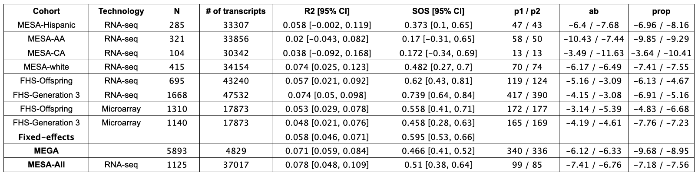
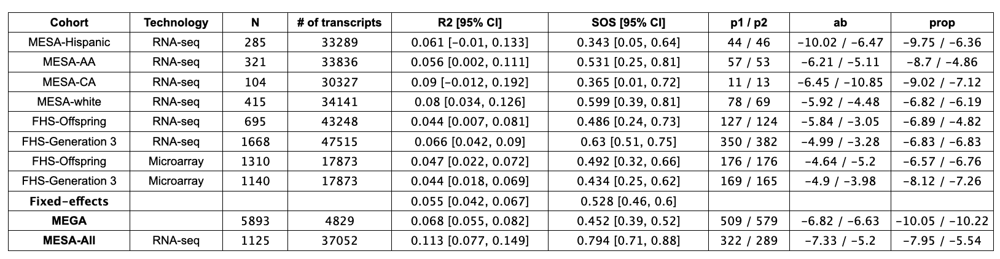
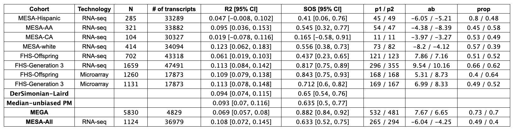
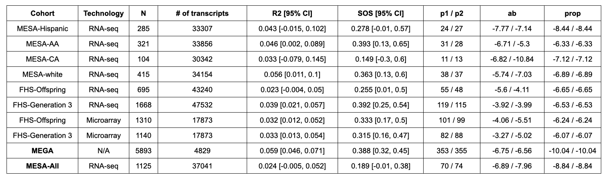
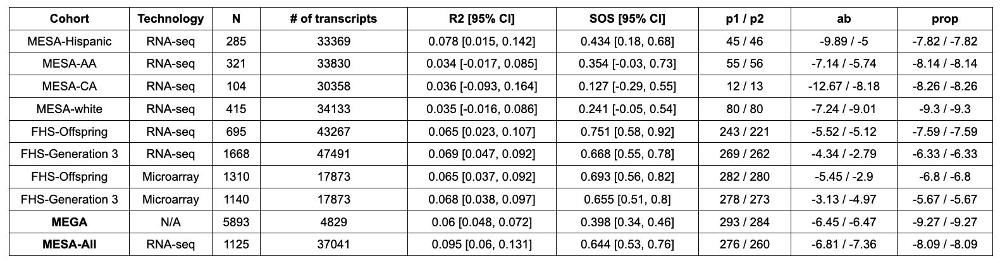

# Meeting Notes

## 2024-09-18 Wed

### MetaR2M: experiment around `nsis` in SIS function for selected genes

For the SBP outcome, 
- we set `nsis` as $\max(n/log(n), 0.01*d),$ where $d$ is the number of genes.
  <div align="center"></div>
- we set `nsis` as $\max(n/log(n), 0.02*d),$ where $d$ is the number of genes.
  <div align="center"></div>

For the HDL outcome, 
- we set `nsis` as $\max(n/log(n), 0.01*d),$ where $d$ is the number of genes.
  <div align="center"></div>
- we set `nsis` as $\max(n/log(n), 0.02*d),$ where $d$ is the number of genes.
  <div align="center"></div>


## 2024-09-11 Wed

### CARDIA data cleaning

Refer to another private [repository](https://github.com/zhichaoxu04/CARDIA).


### MetaR2M: experiment around `nsis` in SIS function for selected genes

For the SBP outcome, 
- we set `nsis` as the NULL, which is the default: $n/log(n)$.
  <div align="center"></div>
- we set `nsis` = 300, the selected genes increased. The FHS selected similar number of genes as MEGA data but MESA did not. 
  <div align="center"></div>

### MetaR2M: response letter
Reviewer 1:
- The proposed definition of mediation effect with R-squared measure lacks causal explanation. The application of the potential outcome framework to describe the R-squared measure for causal explanation remains unclear. The resolution of this key issue is necessary when utilizing the R-squared measure to comprehend causal mediation effects.

- The causal pathway analysis of R-squared measure based mediation effect is difficult to comprehensive. Figure 1 is not suitable for the variance-based R-squared measure of the total mediation effect. For example, when the exposure $X$ is non-random, then $X$ does not affect the variance of Y . That is to say, the R-squared measure is applicable only to random $X$, while it is not suitable for fixed design $X$.
  - Should we use the new Figure 1 as in Biostatistics paper?
  - Explain we could perfrom the R-squared measure as long as there is variability in exposure $X$ and outcome $Y$? 
- The rationale behind conducting a meta-analysis of the total mediation effect remains unclear. How can the consistency of multiple studies originating from the same mediation models be assessed? Further elucidation is required regarding the rationale and benefits of conducting meta-analyses.
  - Show the benefits of meta-analysis in comparing it with MEGA analysis?


Reviewer 3:
- It is not clear how to conduct a meta-analysis with R2 with heterogeneity in confounders.
- Proposed work has connections with estimation of heritability explained by genetic markers  ([Yang et al. [2011]](https://www.ncbi.nlm.nih.gov/pmc/articles/PMC3014363/)). In contrast to proposed method by author, heritability can be explained from the summary level data. Authors propose to run their code on the individual study and then aggregate, which makes applicability of the proposed approach limited.


## 2024-09-04 Wed

### MetaR2M: skewed raw data

- Update the table in the supplementary.
- Simulate $\varepsilon_{2}$ from a $\chi^2(2)$ distribution and scaling it to mimic heavily skewed data.
- The results remain promising.

### MetaR2M: no mediators
- Check the formula for the standard error: when no mediators are selected, the standard error is not zero but is instead extremely small (approximately $1\times 10^{-10}$ in our simulations).
  ```R
    m_yx <- lm(Y[-idx] ~ X[-idx])
    err_yx <- m_yx$residuals
    
    m_yw <- lm(Y[-idx] ~ X[-idx]) # No M
    err_yw <- m_yw$residuals
    
    m_yz <- lm(Y[-idx] ~ 1) # W is X when no M selected
    err_yz <- m_yz$residuals
    
    err_y <- Y[-idx] - mean(Y[-idx])
    
    v_yx <- mean(err_yx^2)
    v_yw <- mean(err_yw^2)
    v_yz <- mean(err_yz^2)
    v_y <- mean(err_y^2)
    
    err <- cbind(err_yx^2,err_yz^2,err_yw^2,err_y^2)
    A <- cov(err)
    a <- c(-1/v_y, -1/v_y, 1/v_y, (v_yx+v_yz-v_yw)/v_y^2)
    v <- t(a) %*% A %*% a
    
    r2_est <- 1.0 - (v_yx + v_yz - v_yw) / v_y
  ```
- The coverage is not good (below 50%) if we proceed to perform meta-analysis in these cases ($M_T$- $M_1$ - $M_2$ - Noise: 0-50-50-1400). In many cases, the iSIS still keeps a few (1 or 2) variables in the model, which cause the bias. If we pool the data (CF-OLS), the coverage is still not good (around 50%).
- Maybe go with the updated sparse case ($M_T$ - $M_1$ - $M_2$ - Noise: 5-0-0-1495 / 15-0-0-1485 / 5-0-0-4995 / 15-0-0-4985), where we have the promising results in the main text.

### MetaR2M: # of genes in MEGA data
- Check the number of overlap genes

| Study     | Off-RNA    | Gen3-RNA    | FHS-Micro   | MESA-RNA    |
| :---:     | :---:      | :---:       | :---:       | :---:       | 
| Off-RNA   | 48384      | 47519       |  14730      | 34679       |
| Gen3-RNA  | /          | 51928       |   14844     | 38038       |
| FHS-Micro | /          | /           |   17873     | 5370        |
| MESA-RNA  | /          | /           |     /       | 44069       |

- The # of overlap between FHS-RNA (Off-RNA + Gen3-RNA) and FHS-Micro is over 80%.
- The overlap between FHS-Micro and MESA-RNA is limited.


### MetaR2M: combine MESA for more selected genes

- Combine MESA into 1 study (we have it in the supplementary before adjusting Top 10 PCs). Repalce it?
- MESA-ALL selected ~70 mediators.
- The source code from iSIS package to calculate the number of pedictors recuited by (I)SIS.
  ```R
  calculate.nsis <- function(family, varISIS, n, p) {
  if (varISIS == "aggr") 
    nsis = floor(n/log(n)) else {
      if (family == "gaussian") {
        nsis = floor(n/log(n))
      }
      if (family == "binomial") {
        nsis = floor(n/(4 * log(n)))
      }
      if (family == "poisson") {
        nsis = floor(n/(2 * log(n)))
      }
      if (family == "cox") {
        nsis = floor(n/(4 * log(n)))
      }
    }
  if (p < n) 
    nsis = p
  return(nsis)
  }

  ```

